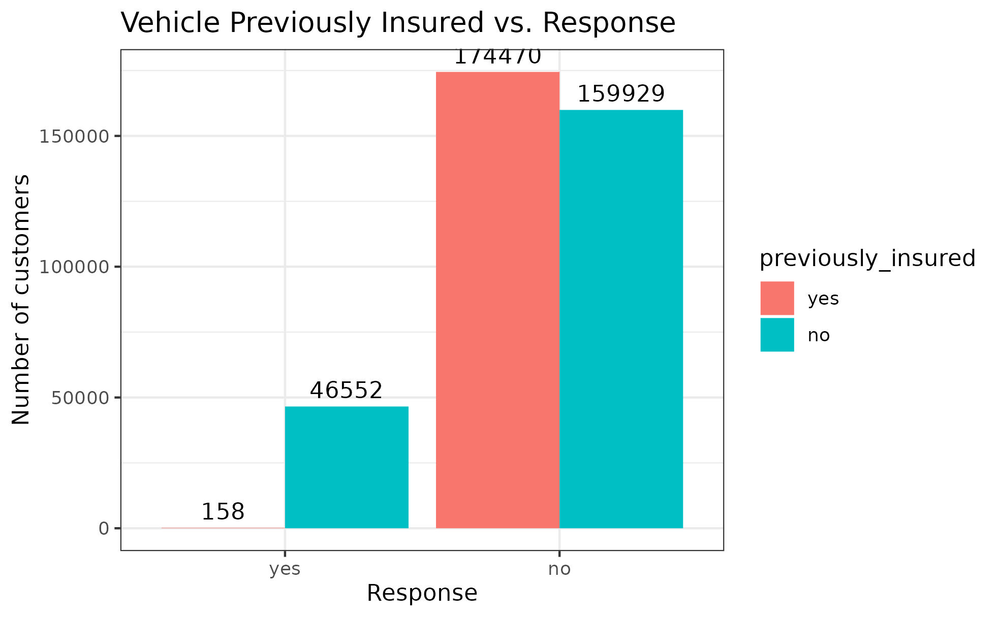

# Venda Cruzada de Seguro de Automóveis

Este é um projeto fictício. A empresa, o contexto e as perguntas de negócios não são reais. Este portfólio está seguindo as recomendações do blog da [Comunidade DS](https://www.comunidadedatascience.com/como-usar-data-science-para-fazer-a-empresa-vender-mais/).

Os arquivos com todos os passos realizados está disponivel [aqui](https://github.com/douglasaturnino/data_science_with_r).
O aplicativo  Shiny com os produtos de dados em produção pode ser acessado clicando [aqui](https://douglasaturnino.shinyapps.io/car_insurance/).
O dataset está disponivel no [Kaggle](https://www.kaggle.com/datasets/anmolkumar/health-insurance-cross-sell-prediction).

Este projeto foi feito por Douglas Saturnino.

# 1. Problema de negócio

A Insurance All é uma empresa que fornece seguro de saúde para seus clientes e o time de produtos está analisando a possibilidade de oferecer aos assegurados, um novo produto: Um seguro de automóveis.

Assim como o seguro de saúde, os clientes desse novo plano de seguro de automóveis precisam pagar um valor anualmente à Insurance All para obter um valor assegurado pela empresa, destinado aos custos de um eventual acidente ou dano ao veículo.

A Insurance All fez uma pesquisa com cerca de 380 mil clientes sobre o interesse em aderir a um novo produto de seguro de automóveis, no ano passado. Todos os clientes demonstraram interesse ou não em adquirir o seguro de automóvel e essas respostas ficaram salvas em um banco de dados junto com outros atributos dos clientes.

O time de produtos selecionou 127 mil novos clientes que não responderam a pesquisa para participar de uma campanha, no qual receberão a oferta do novo produto de seguro de automóveis. A oferta será feita pelo time de vendas através de ligações telefônicas.

Nesse contexto, você foi contratado como um consultor de Ciência de Dados para construir um modelo que prediz se o cliente estaria ou não interessado no seguro de automóvel. 

Com a sua solução, o time de vendas espera conseguir priorizar as pessoas com maior interesse no novo produto e assim, otimizar a campanha realizando apenas contatos aos clientes mais propensos a realizar a compra.

Como resultado da sua consultoria, você precisará entregar um relatório contendo algumas análises e respostas às seguintes perguntas:

Principais Insights sobre os atributos mais relevantes de clientes interessados em adquirir um seguro de automóvel.

# 2. Premissas de Negócios

Cada linha representa um cliente e cada coluna contém alguns atributos que descrevem esse cliente, além da sua resposta à pesquisa, na qual ela mencionou interesse ou não ao novo produto de seguros. 

O conjunto de dados inclui as seguintes informações:
Variável | Definição
------------ | -------------
|Id| Identificador único do cliente.|
|Gender| Gênero do cliente.|
|Age| Idade do cliente.|
|Driving License| 0, o cliente não tem permissão para dirigir e 1, o cliente tem para dirigir ( CNH – Carteira Nacional de Habilitação )|
|Region Code| Código da região do cliente.|
|Previously Insured| 0, o cliente não tem seguro de automóvel e 1, o cliente já tem seguro de automóvel.|
|Vehicle Age| Idade do veículo.|
|Vehicle Damage| 0, cliente nunca teve seu veículo danificado no passado e 1, cliente já teve seu veículo danificado no passado.|
|Anual Premium| Quantidade que o cliente pagou à empresa pelo seguro de saúde anual.|
|Policy sales channel| código anônimo para o canal de contato com o cliente.|
|Vintage| número de dias que o cliente se associou à empresa através da compra do seguro de saúde.|
|Response| 0, o cliente não tem interesse e 1, o cliente tem interesse.|

# 3. Estratégia de solução

Para conseguir o resultado com maior probabilidade de  um cliente adquirir um seguro, foi feita as etapas descrita abaixo:

**Step 01. Descrição dos Dados:**

Etapa onde foi renomeado as variaveis para o padrão onde os espaços são substituidos por underline( _ ) e todas as palavras são em letra minuscula. Também verificou-se a quantidade de linhas e colunas do dataset e o seu tipo de dados

**Step 02. Engenharia de Atributo**

Nessa etapa as respostas do atributos "vehicle age" foram alteradas para o padrão snake_case e as respostas dos atributos "driving_license", "previously_insured" e "response" também foram alteradas: os originais "1" e "0" por "yes" e "no", respectivamente e colocada como fator

**Step 03. Filtragem dos Dados:**

Nessa etapa ocorre a manipulação dos valores ausentes e autliers, nesse conjunto de dados não foi encontrado valores ausentes por essa razão essa etapa não foi feita nada.

**Step 04. Análise exploratória de dados:**

Nessa etapa foram relizadas as análises específicas para entender a influencia de algumas caracteristicas na decisão final do cliente em adquirir um seguro.

**Step 05. Preparação dos dados:**

Nessa etapa foi feita a padronização, reescala e transformação dos dados

**Step 06. Seleção de variaveis:**

Nessa etapa foi feita a identificação das variaveis mais importantes para o treinamento do modelo de aprendizado de maquina. Para isso, foi utilizado o modelo randomForest para selecionar os atributos.

**Step 07. Machine Learning Modelling:**

Nessa etapa é utilizada para avaliar e testar os algoritmos de aprendizado de máquina KNN Classifier, logistic regression, Extra Trees classifier, Random Forest, XGBoost Regressor.

**Step 08. Performece do modelo:**

Nessa etapa é verifiicada a performance de cada modelo criado e foi escolhido o modelo KNN.

**Step 09. Hyperparameter Fine Tuning:**

Nesse etapa foi escolhodo o modelo de KNN porque foi o medelo com o melhores resultandos utilizando ohyperparameter fine tunning.

**Step 10. Converter o modelo em valores de negócios:**

O gerente recebeu uma lista ordenada de clientes com maior probabilidade de adquirir um seguro de veículo. Ao entrar em contato com os 20% melhores da lista, espera-se que haja uma conversão de pelo menos 90% do total de interessados no produto.

**Step 11. Deploy Modelo to Production:**

Para o deploy do modelo foi desenvolvemos um aplicativo Shiny que pode ser acessado clicando [aqui](https://douglasaturnino.shinyapps.io/car_insurance/).

# 4. Modelos de Machine Learning

Nessa etapa é utilizada para avaliar e testar os algoritmos de aprendizado de máquina logistic regression, Decision Tree, Random Forest, XGBoost Regressor e KNN.

# 5. Performance do Modelo de Machine Learning
A performance de cada modelo escolhido está na tabela abaixo usando precisão e reacall. O @k representa os dados de 2 mil ligações.

|model | precision_at_k | recall_at_k|
|:-------| :----------:	| :---------:|
|KNN| 0.348 |     1|      
|Decision Tree | 0.305 | 0.416 |
|Random Forest | 0.457 | 0.0188 |
|XGBoost| 0.571 | 0.00459 |
|Logistic Regression | NaN | 0 |    

# 6. Business Results
Agora será mostrado o relatório com as análises e responder as perguntas de negocios.

## 1. Principais Insights sobre os atributos mais relevantes de clientes interessados em adquirir seguro de automóvel.

**Hypothesis 01:**
O interese pelo seguro de carro é maior em clientes mais velhos. ✅

**True/False.**

Hipotese verdadeira. Os jovens parecem estar menos interessados no seguro automóvel. A idade média dos clientes interessados é de 43 anos (AIQ: 35, 51), enquanto a mediana dos clientes não interessados é de 34 anos (AIQ: 24, 49).

**Hypothesis 02:**

Os clientes que possuem carros mais novos têm maior probabilidade de se interessar pelo seguro automóvel. ❌

**True/False.**

Hipotese falsa. Os clientes com automóveis com idade entre 1 e 2 anos têm maior probabilidade de se interessar pelo seguro automóvel (75%). Enquanto apenas 15% dos clientes interessados possuem carros mais novos.

**Hypothesis 03:**

Clientes com danos anteriores no carro têm maior probabilidade de aceitar o seguro automóvel ✅

Hipotese verdadeira. Os clientes com danos anteriores no carro provavelmente estarão interessados no seguro automóvel, já que 98% disseram que sim.

# 7. Conclusão

Conforme os critérios estabelecidos, elaboramos uma lista dos clientes com maior interesse em adquirir um seguro de automóveis. Como resultado para o negócio, desenvolvemos um aplicativo Shiny com as seguintes características:

Uma aba na qual é possível inserir informações sobre um cliente e obter a probabilidade de adquirir um seguro.

Na segunda aba, é possível fazer upload de um arquivo CSV e obter uma lista ordenada de potenciais clientes para contatar e oferecer seguro automotivo. Além disso, é possível baixar a saída como arquivo CSV ou Excel.

Abaixo mostra como usar o aplicativo para fazer a previsão de clientes.

<video src="https://gist.github.com/assets/95532957/74a78324-49a6-4113-aef9-c9f6dc0aed03" width="640" height="360" controls></video>

# 8. Próximos passos

Algumas melhorias no projeto podem ser incrementadas no futuro:

* Colocar as classes das linhas do grafico e a porcentagem
* Testes novos modelos e fazer o balanciamento de classe para melhorar a performance do modelo

# 9. Referências

- Este Projeto foi feito como parte do curso "Ciência de Dados com R", da Comunidade DS.

